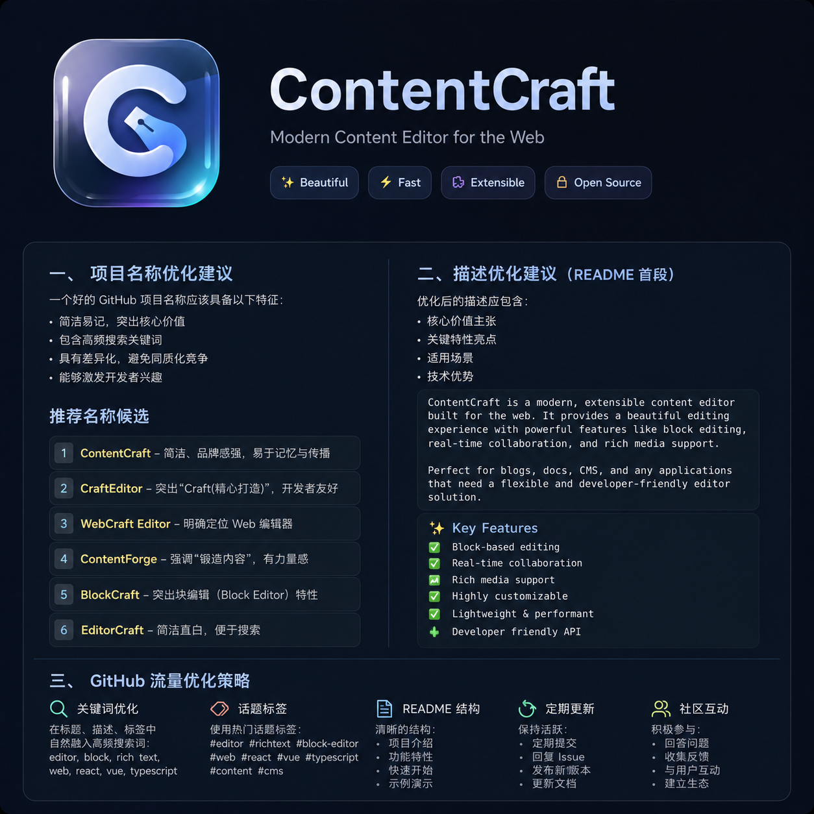

# ContentCraft — Open-source WeChat Article Editor

<p align="center">
  
</p>

<p align="center">
  <strong>Import WeChat articles, extract SVG layout modules, replace images safely, and build a reusable local-first content library.</strong>
</p>

<p align="center">
  <a href="https://github.com/luobuchao0321/wechat-article-editor/releases/tag/v1.0.1">Desktop App</a> ·
  <a href="#features">Features</a> ·
  <a href="#quick-start">Quick Start</a> ·
  <a href="#supported-platforms">Platforms</a> ·
  <a href="./README.md">中文</a>
</p>

---



## Positioning

ContentCraft is an open-source WeChat article editor for importing WeChat articles, reusing SVG layout modules, replacing images safely, and building local-first content workflows.

It is not just another rich-text editor. Its core workflow is WeChat article import, SVG layout extraction, reusable module editing, asset persistence, and clean HTML export for WeChat editors, 135-style editors, CMS systems, and KindEditor-style backends.

## Features

- **WeChat Article Import** — Import article content and extract text, images, SVGs, and layout modules
- **Style Editing** — Visual editing of background colors, fonts, alignment, spacing, and more
- **Module Management** — Insert SVG modules as independent blocks; move up/down, add/remove spacing
- **Image Replacement** — Click images within modules to replace; auto-detects recommended pixel dimensions
- **Asset Library** — Import and persistently store custom WeChat styling assets, SVG modules, and GIFs
- **One-click HTML Copy** — Export inline HTML for WeChat editors, 135-style editors, CMS systems, and KindEditor-like backends
- **Multi-format Import** — Supports HTML, Word, PDF, Excel, and more
- **System Fonts** — Auto-detects installed OS fonts (macOS / Windows / Linux)
- **Local-first Workflow** — Drafts and reusable materials are stored locally by default
- **Desktop Builds** — macOS, Windows, and Linux installers are available from GitHub Releases

## Quick Start

### Requirements

- Node.js >= 18.0.0
- npm >= 9.0.0 or pnpm >= 8.0.0

### Install and Run

```bash
# Clone the repository
git clone https://github.com/luobuchao0321/wechat-article-editor.git
cd wechat-article-editor

# Install dependencies
npm install
# or
pnpm install

# Start development server (defaults to http://localhost:3001)
npm run dev
```

### Production Build

```bash
npm run build
npm start
```

## Desktop App

Download the latest installers from:

[ContentCraft v1.0.1 Release](https://github.com/luobuchao0321/wechat-article-editor/releases/tag/v1.0.1)

## Supported Platforms

| Platform | Status | Notes |
| --- | --- | --- |
| Web | Supported | Chrome / Edge / Safari / Firefox |
| macOS | Supported | DMG for Apple Silicon and Intel |
| Windows | Supported | NSIS installers for x64 and 32-bit |
| Linux | Supported | AppImage and deb |

## Tech Stack

- **Framework**: Next.js 16 + React 19
- **Language**: TypeScript 5
- **Styling**: Tailwind CSS 3

## Contributing

Issues and Pull Requests are welcome!

1. Fork this repository
2. Create your feature branch (`git checkout -b feature/your-feature`)
3. Commit your changes (`git commit -m 'Add some feature'`)
4. Push to the branch (`git push origin feature/your-feature`)
5. Open a Pull Request

## License

[MIT](./LICENSE) © ContentCraft

## Acknowledgments

- Independently developed; no copyrighted materials from third-party editors used
- Inspired by the WeChat content editing workflow; built as an open-source tool for content creators
