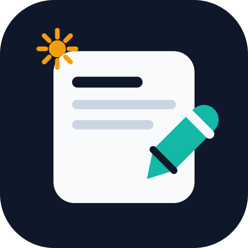
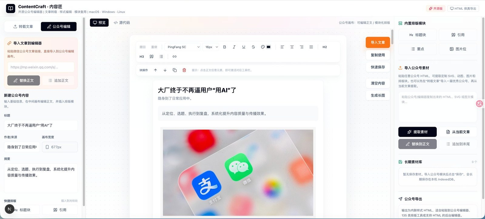

# ContentCraft — Open-source WeChat Article Editor

<p align="center">
  
</p>

<p align="center"><strong>Import a WeChat article, reuse its layout blocks, safely replace images, and build a local content library you own.</strong></p>

<p align="center">
  <a href="https://github.com/luobuchao0321/wechat-article-editor/releases/latest"><strong>Download Desktop App</strong></a> ·
  <a href="#quick-start">Quick start</a> ·
  <a href="#features">Features</a> ·
  <a href="./README.md">中文</a>
</p>



## Why ContentCraft

ContentCraft is a local-first editor for people who need to reuse real WeChat article layouts. Import an article you are authorized to use, extract layout blocks, replace an individual image without breaking the surrounding module, save useful blocks locally, then copy compatible inline HTML to a WeChat editor or another rich-text backend.

You do not need to know SVG or HTML to use the editor. SVG layout extraction is an implementation detail that helps preserve complex visual modules.

## Quick start

1. Open the `WeChat editor` workspace.
2. Choose `Load sample` to try module selection, image replacement, and local saving immediately.
3. Paste a public `https://mp.weixin.qq.com/s/...` link and import it into the canvas.
4. Select a block or image, edit it, save reusable modules, and copy the final inline HTML.

## Features

- Import public WeChat articles and extract text, images, SVGs, and layout blocks.
- Edit blocks independently: move, duplicate, delete, add spacing, and adjust visual styles.
- Replace a specific image inside a module with recommended dimensions.
- Save reusable title blocks, image cards, separators, GIFs, and footers to a local IndexedDB library.
- Copy inline HTML for WeChat editors, CMS tools, and source-mode rich-text backends.
- Import HTML, Word, PDF, and Excel content.
- Connect your own AI provider for titles, summaries, polishing, humanization, and risk checks.
- Run locally on the web or use desktop builds for macOS, Windows, and Linux.

## Download and run

Download the appropriate installer from the [latest release](https://github.com/luobuchao0321/wechat-article-editor/releases/latest). See [desktop download notes](./docs/DOWNLOADS.md) for platform guidance and checksums.

```bash
git clone https://github.com/luobuchao0321/wechat-article-editor.git
cd wechat-article-editor
npm install
npm run dev
```

Open `http://localhost:3001`.

## Privacy and deployment

Drafts and saved modules remain in local browser or desktop-app storage by default. Read [privacy and local data](./docs/PRIVACY.md) before deploying for a team, and [SECURITY.md](./SECURITY.md) before exposing a public deployment.

## Contributing

The [examples](./examples/README.md) directory contains copyright-safe fixtures. Contributions are welcome, especially around imported layout compatibility, image replacement regression tests, and local library import/export.

Please read [CONTRIBUTING.md](./CONTRIBUTING.md) first.

## License

[MIT](./LICENSE) © ContentCraft
